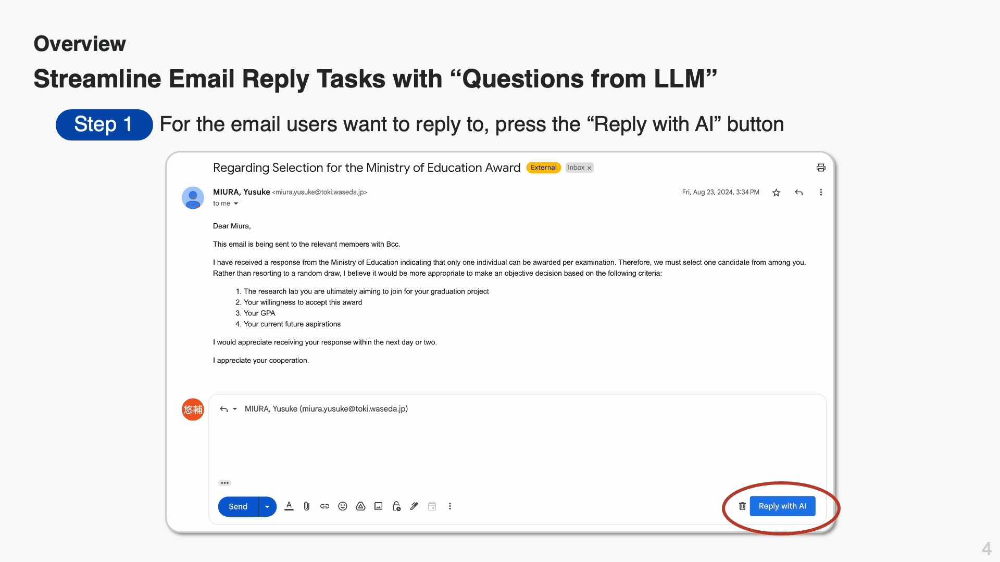

# Understanding and Supporting Formal Email Exchange by Answering AI-Generated Questions

[](https://github.com/cvpaperchallenge/Ascender)
[](https://arxiv.org/abs/2502.03804)
[](https://dl.acm.org/doi/abs/10.1145/3706598.3714016)



> **Note**: A Japanese version of this README is available [here](./README_ja.md).

The repository contains the code that accompanies our CHI 2025 paper.

## Abstract

Replying to formal emails is time-consuming and cognitively demanding, as it requires crafting polite phrasing and providing an adequate response to the sender's demands. Although systems with Large Language Models (LLMs) were designed to simplify the email replying process, users still need to provide detailed prompts to obtain the expected output. Therefore, we propose and evaluate an LLM-powered question-and-answer (QA)-based approach for users to reply to emails by answering a set of simple and short questions generated from the incoming email. We developed a prototype system, ResQ, and conducted controlled and field experiments with 12 and 8 participants. Our results demonstrated that the QA-based approach improves the efficiency of replying to emails and reduces workload while maintaining email quality, compared to a conventional prompt-based approach that requires users to craft appropriate prompts to obtain email drafts. We discuss how the QA-based approach influences the email reply process and interpersonal relationship dynamics, as well as the opportunities and challenges associated with using a QA-based approach in AI-mediated communication.

## ResQ - QA-based Email Reply Assistant

ResQ is a system that leverages OpenAI’s Large Language Models to assist with email replies. It analyzes the incoming email’s content, generates questions to support your reply, and then produces a draft response based on your answers.
The Chrome extension is available for installation from this [Link](https://chromewebstore.google.com/detail/diibecmhllgfkglodjgifjapchbanimk?utm_source=item-share-cb).

### Features

- 💬 **Interactive Question Generation**  
  ResQ analyzes the incoming email and automatically generates short, focused questions to clarify the content or request additional details needed for the reply.
  
- ✍️ **Context-Aware Draft Generation**  
  Based on your answers and the context extracted from the original email, ResQ composes a concise and well-structured reply draft.
  
- 🚀 **Streaming Response**  
  The system streams the generated content in real time, allowing you to watch the reply take shape and refine it quickly.

### Project Structure

ResQ is composed of two main components, managed through Docker Compose as microservices:

1. **Backend** (`applications/backend`):  
   - Analyzes the email content and generates replies using LLMs.
2. **Chrome Extension** (`applications/chrome-extension`):  
   - Provides an interactive interface in your browser, displaying the questions and AI-generated draft replies.

Please see the documentation within the `docs/` folder for more details on each service.

#### Folder Structure

```
ResQ/
├── .github/                   # GitHub-related files
│   ├── ci.yaml                # Workflow definition for code checks
│   ├── deploy.yaml            # Workflow definition for application deployment
│   ├── terraform-ecr.yml      # Reusable Workflow: Provisions Amazon ECR via Terraform
│   └── terraform-complete.yml # Reusable Workflow: Provisions Amazon ECR and AWS Lambda via Terraform
├── applications/              # Application implementations
│   ├── backend/               # Backend implementation (see docs/backend.md for details)
│   ├── chrome-extension/      # Frontend implementation for the Chrome extension
│   └── chrome-extension-orig/ # Frontend implementation for the Chrome extension
├── docs/                      # Documentation
├── environments/              # Docker-related configurations
│   ├── ci/                    # Docker Compose definitions for CI
│   ├── deploy/                # Docker Compose definitions for deployment
│   ├── dev/                   # Docker Compose definitions for development
│   ├── Dockerfile.backend     # Dockerfile for backend
│   ├── Dockerfile.chrome      # Dockerfile for Chrome extension
│   └── Dockerfile.deploy      # Dockerfile for deployment
├── terraform/                 # Infrastructure-as-code definitions
│   ├── modules/               # Terraform modules
│   │   ├── ecr/               # ECR repository and IAM role definitions
│   │   └── lambda/            # Lambda function and associated resources
│   ├── provider.tf            # AWS provider settings
│   ├── variables.tf           # Variable definitions
│   └── main.tf                # Usage of modules
└── README.md
```

## Quick Start

This guide outlines how to quickly spin up ResQ with Docker Compose for local usage. By following these steps in order, you can run both the backend and the Chrome extension on your machine.

1. **Install Dependencies**
   - [Docker](https://docs.docker.com/engine/install/)
   - [Docker Compose](https://docs.docker.com/compose/install/)

2. **Set Environment Variables**
   ```bash
   # Create a copy of the sample environment variables file
   cp environments/backend.env.sample environments/backend.env
   ```

   Then open the newly created `backend.env` file and specify the necessary environment variables.

   > [!Note]
   > `OPENAI_API_KEY` should be set to the API key you generated in the OpenAI [Dashboard](https://platform.openai.com/api-keys).
   > `CORS_ALLOW_ORIGINS` should include the origin(s) that are allowed to connect to the backend (e.g., http://localhost:3000 if you are testing locally).

3. **Run Docker Containers**
   ```bash
   # In the environments/dev directory, start the development containers in detached mode
   cd environments/dev
   docker compose up -d
   ```

4. **Access the Containers**
   - Backend
       ```bash
       # Still in environments/dev
       docker compose exec backend bash
       ```

   - Chrome Extension
       ```bash
       # Still in environments/dev
       docker compose exec chrome-extension bash
       ```

   After entering the container, refer to the documentation in each service’s `docs` folder for further setup instructions.

5. **Load the Chrome Extension**
   1. Open Google Chrome and go to `chrome://extensions/`.
   2. Enable **Developer Mode** (usually in the top-right corner).
   3. Click **Load unpacked** and select the `applications/chrome-extension-orig` folder (or wherever the extension’s build artifacts are located).
   4. The **ResQ** extension should now appear in your extension list.

6. **How to Use ResQ**
   1. Open an email you want to reply to.
   2. ResQ automatically generates short questions regarding the email content.
   3. Provide brief answers to these questions.
   4. ResQ composes a draft reply based on your answers and the email context.
   5. Edit the draft if needed, then send your final reply.

## Acknowledgements

We thank the [Ascender](https://github.com/cvpaperchallenge/Ascender) for making this work possible.

