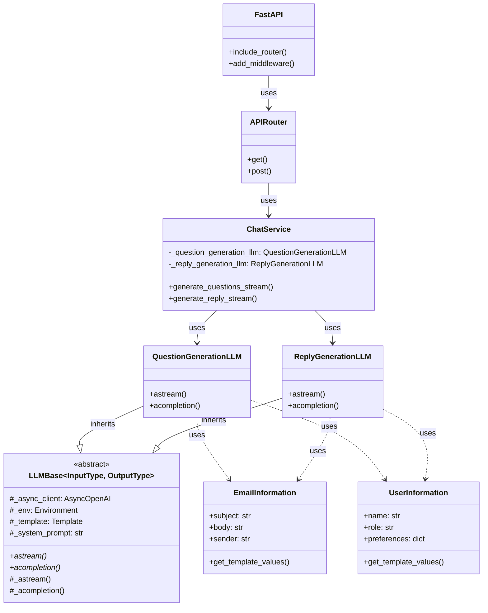
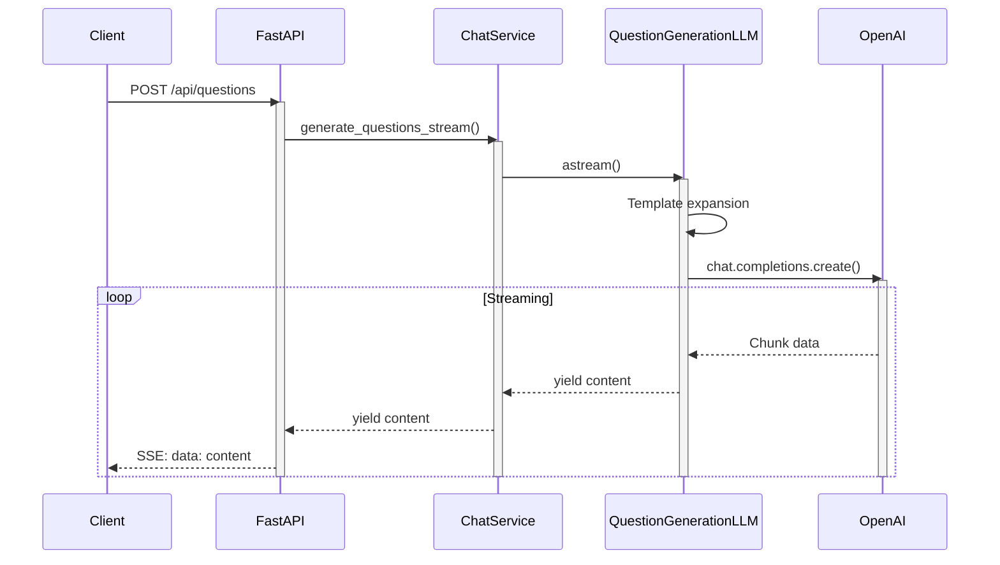
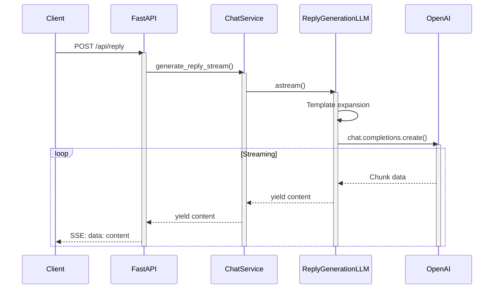

# Backend Service

## Setup

> [!Note]
> Please refer to the project's top-level `README.md` for setting up the development environment using Docker for this project.

1. Creating a virtual environment and installing libraries

    This project uses [uv](https://docs.astral.sh/uv/) as the virtual environment and Python library management tool. Run the following command inside the container to install the necessary libraries in the virtual environment:

    ```bash
    uv sync
    ```

2. Starting the development server

    ```bash
    poe run-backend-dev
    ```

    This will start the server at http://localhost:8000.

3. Using API endpoints

    You can access http://localhost:8000/docs to check the behavior of the actual endpoints through Swagger UI.

    

## Development Guide

### Folder Structure

The backend of this project adopts a simple layered architecture.

```
src/
├── api/           # Presentation layer: HTTP interface
│   ├── routes.py  # Endpoint definitions
│   └── schemas.py # Request/response schema definitions
│
├── domain/        # Domain layer: Business logic
│   ├── models/    # Domain model definitions
│   └── services/  # Business logic implementation
│       └── llm/   # LLM-related implementations
│
└── main.py        # Application entry point
```

### API Endpoints

- `GET /api/health`: Health check
- `POST /api/questions`: Generate questions based on email content (SSE Streaming)
- `POST /api/reply`: Generate email replies (SSE Streaming)


### Development Commands

This project uses [poethepoet](https://poethepoet.natn.io/index.html) as a task runner. You can execute frequently used development tasks with the following commands:

```bash
# Start the development server
poe run-backend-dev

# Format code
poe format

# Run linter
poe lint

# Run tests
poe test

# Run all checks
poe test-all
```

We use the following tools for code quality management:

- **[ruff](https://docs.astral.sh/ruff/)**: Linting and formatting
- **[mypy](https://www.mypy-lang.org/)**: Static type checking
- **[pytest](https://docs.pytest.org/en/stable/)**: Testing
- **[mdformat](https://github.com/hukkin/mdformat)**: Markdown formatting

## FAQ

### Q. How do I add a new Python package?

A. Either use `uv add <LIBRARY_NAME>` to add the required library, or directly edit the dependencies in `pyproject.toml` and update the virtual environment with `uv sync`. For more details about `uv` commands, please refer to [this documentation](https://docs.astral.sh/uv/reference/cli/).

### Q: I want to know more about endpoint streaming responses

A: For question generation and reply generation endpoints, we've implemented streaming responses using [Server-sent-events](https://developer.mozilla.org/en-US/docs/Web/API/Server-sent_events/Using_server-sent_events) as a response to POST requests from clients.

For the definition of each event format, refer to [this link](https://developer.mozilla.org/en-US/docs/Web/API/Server-sent_events/Using_server-sent_events#event_stream_format), and for client-side event handling procedures, refer to [this link](https://html.spec.whatwg.org/multipage/server-sent-events.html#event-stream-interpretation).

### Q: Where are system prompts and templates managed?

A: They are managed in the `data/` directory:
- `system_prompts/`: LLM system prompts
- `templates/`: Prompt templates (Jinja2 format)

These are loaded in the constructors (`__init__`) of concrete LLM service classes (`QuestionGenerationLLM`, `ReplyGenerationLLM`).

Prompt templates are written in Jinja2 format, and the following information is generated and populated from the code:
- Email information (subject, body, sender information, etc.)
- User information (name, position, preferences, etc.)
- Customization settings (tone, style, etc.)

### Q: How do I run in production?

A: You can start the production server with the following command:
```bash
poe run-backend-prod
```
This will start a Gunicorn server running with four worker processes.

Currently, it's fine to use the development server, but when deploying to cloud services like AWS, please use the above command.

### Q: How do I add a new LLM feature?

A: You can implement it with the following steps:

1. Create a new LLM class in `src/domain/services/llm/`
   ```python
   class NewFeatureLLM(LLMBase[InputType, OutputType]):
       def __init__(self, prompt_directory: pathlib.Path) -> None:
           template_path = prompt_directory / "templates" / "new_feature_template.jinja2"
           system_prompt_path = prompt_directory / "system_prompts" / "new_feature_system_prompt.txt"
           super().__init__(template_path, system_prompt_path)
   ```


2. Inherit from `LLMBase` and implement necessary methods
   - `astream`: Response generation in streaming format
   - `acompletion`: Response generation in batch format

3. Add necessary prompts and templates to `data/`
   - System prompt: Define LLM role and constraints
   - Template: Define structured format for input data

4. Integrate the new feature into `ChatService` (or create a new service class if needed)

> [!IMPORTANT]
> `LLMBase` uses generics to ensure type safety for `astream` and `acompletion` input/output. Therefore, when defining concrete classes that inherit from it, please specify appropriate type arguments (`InputType`, `OutputType`).

## System Architecture Details

### Class Diagram



### Sequence Diagram (Question Generation Flow)



### Sequence Diagram (Reply Generation Flow)


