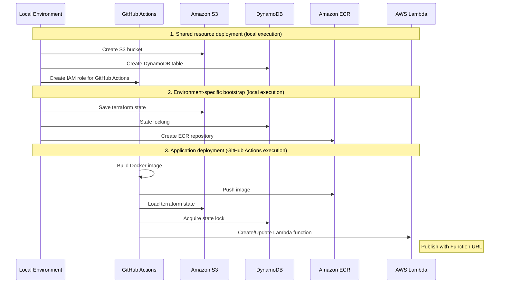
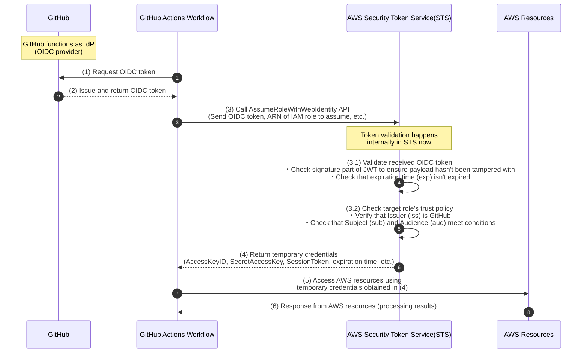

# Application Backend Deployment

In this project, we use GitHub Actions and [Terraform](https://developer.hashicorp.com/terraform) for continuous delivery (CD) to AWS Lambda. If you are using the backend server published by this project, you don't need to worry about this. However, if you want to improve the application yourself and self-host it on AWS, please refer to the following steps.

## Prerequisites

### 1. AWS Related Preparation

 - Create an account

   This project supports [AWS](https://aws.amazon.com/) as the cloud provider for deployment. If you don't have an AWS account, please create one first.

   The AWS services used in this application are:
   - [Amazon Elastic Container Registry (ECR)](https://aws.amazon.com/ecr/): For storing Docker images used to create AWS Lambda functions
   - [AWS Lambda](https://aws.amazon.com/lambda/): For running the application backend as serverless functions
   - [Amazon S3](https://aws.amazon.com/s3/): For Terraform state management
   - [Amazon DynamoDB](https://aws.amazon.com/dynamodb/): For Terraform state locking

  All services can be used within the free tier limits without charges, but please check the details carefully before using.

  - [AWS Lambda pricing](https://aws.amazon.com/lambda/pricing/)
  - [Amazon ECR pricing](https://aws.amazon.com/ecr/pricing/)
  - [Amazon S3 pricing](https://aws.amazon.com/s3/pricing/)
  - [Amazon DynamoDB pricing](https://aws.amazon.com/dynamodb/pricing/)

> [!Important]
> Please note that we cannot take responsibility for any unexpected charges incurred as a result of following the deployment procedures in this document.

 - Environment variable setup

   To allow access to AWS resources from your local environment or GitHub Actions workflow environment, you need to obtain AWS authentication keys. Specify the required environment variables in `environments/terraform.env` (for more details, refer to the [Authentication Mechanism](#supplementary-authentication-mechanism) section).

   The `*.env` files are excluded from Git tracking for security reasons, so you need to create the file yourself by copying `*.env.sample` first.

   ```bash
   cp environments/terraform.env.sample environments/terraform.env
   ```

   Specify the following environment variables in the copied file:

   ```Dotenv
   # AWS credentials
   AWS_ACCESS_KEY_ID="<AWS_ACCESS_KEY_ID>"
   AWS_SECRET_ACCESS_KEY="<AWS_SECRET_ACCESS_KEY>"
   AWS_SESSION_TOKEN="<AWS_SESSION_TOKEN>"
   AWS_DEFAULT_REGION="<AWS_DEFAULT_REGION>"
   ```

### 2. GitHub Repository Variables/Secrets Setup

The environment variables referenced in the GitHub Actions workflow need to be specified on GitHub after you clone this repository to your GitHub account.

GitHub provides a feature called [Environments](https://docs.github.com/en/actions/managing-workflow-runs-and-deployments/managing-deployments/managing-environments-for-deployment) for defining and managing deployment environments. Use this feature to register the necessary environment variables. Create two environments named **`dev`** and **`prod`** from your repository's "Settings" -> "Environments", and register the following environment variables as [Environment secrets](https://docs.github.com/en/actions/managing-workflow-runs-and-deployments/managing-deployments/managing-environments-for-deployment#environment-secrets) and [Environment variables](https://docs.github.com/en/actions/managing-workflow-runs-and-deployments/managing-deployments/managing-environments-for-deployment#environment-variables) for each environment:

 - Environment secrets

   ```yaml
   OPENAI_API_KEY: "sk-xxxxxxxxxxxxxxxxxxxxxxxxxxxxxxxxxxxxxxxxxxxxxxxx" # OpenAI API key
   ALLOWED_ORIGINS: "["chrome-extension://<EXTENSION_ID>"]" # List of allowed origins in list(string) format
   ```

 - Environment variables

   ```yaml
   PROJECT_NAME: "Project-Name" # Project name (used as an identifier for AWS resources)
   AWS_ACCOUNT_ID: "123456789012"  # AWS account ID
   AWS_REGION: "ap-northeast-1" # AWS region name. Must be the same as `AWS_DEFAULT_REGION` set in step 1
   LAMBDA_MEMORY: "512" # Lambda function memory size (MB)
   LAMBDA_TIMEOUT: "30" # Lambda function timeout setting (seconds)
   ```

>[!Warning]
> GitHub's Environments feature is only available for Public repositories for Free plan users. If you want to use it with a Free plan Private repository, use [Repository secrets](https://docs.github.com/en/actions/security-for-github-actions/security-guides/using-secrets-in-github-actions#creating-secrets-for-a-repository) and [Repository variables](https://docs.github.com/en/actions/writing-workflows/choosing-what-your-workflow-does/store-information-in-variables#creating-configuration-variables-for-a-repository) instead. In this case, you'll need to modify the `.github/workflows/deploy.yml` file's `workflow dispatch.inputs` appropriately (for example, you can remove the input itself and hardcode `inputs.environment` as "prod" throughout the `.github/workflows/deploy.yml` workflow).

> [!Important]
> Cross Origin Resource Sharing (CORS) is a **browser** constraint that applies when requests are sent from one origin to an API server located at another origin. Setting this up only restricts requests from Chrome Extensions when accessed through a browser. Requests can still be sent from any IP address using tools like curl or Postman. This project includes CORS settings from the beginning as it will be necessary for security when adding authentication to the backend.

### 3. Branch Setup

For typical application deployments, different branches are used for production and development environments. Please create the following two branches:

- `develop` branch: Used for deployment to the development environment
- `release` branch: Used for deployment to the production environment

If you adopt different branch names, please modify the branch names used in the condition check in the last step of `.github/workflows/terraform-reusable.yml`:

```yaml
...
- name: Terraform Apply
   working-directory: ${{ env.DOCKER_COMPOSE_DIRECTORY }}
   if: github.ref == 'refs/heads/develop' || github.ref == 'refs/heads/release' # <--- Change these two branch names here
   run: docker compose exec -T terraform terraform -chdir=environments apply -auto-approve tfplan
...
```

> [!Important]
> Just creating Environments and corresponding branches in steps 2 and 3 would still allow deploying `develop` branch content to the `prod` environment. It is strongly recommended to set up [deployment protection rules](https://docs.github.com/en/actions/managing-workflow-runs-and-deployments/managing-deployments/managing-environments-for-deployment#deployment-protection-rules) to restrict which branches can be deployed to each environment, or to require reviewer approval for deployments.

### 4. Terraform Related Setup

- `*.tfvars` file setup

   This project uses externally specified variables for some Terraform resource provisioning. These variables are managed in `*.tfvars` files, which need to be configured before running terraform commands. Note that `*.tfvars` files are excluded from Git tracking for security reasons, so you need to create them yourself by copying `*.tfvars.sample` first.

   - `terraform/bootstrap/shared/terraform.tfvars`

      Create the file:
      ```bash
      cp terraform/bootstrap/shared/terraform.tfvars.sample terraform/bootstrap/shared/terraform.tfvars
      ```

      Fill in the variables:
      ```terraform
      project_name      = "Project-Name" # Project name. Must be the same as `PROJECT_NAME` set in step 2
      github_repository = "OwnerName/RepositoryName" # Owner and repository name combined
      ```

   - `terraform/bootstrap/dev/terraform.tfvars`

      Create the file:
      ```bash
      cp terraform/bootstrap/dev/terraform.tfvars.sample terraform/bootstrap/dev/terraform.tfvars
      ```

      Fill in the variables:
      ```terraform
      project_name = "Project-Name" # Project name. Must be the same as `PROJECT_NAME` set in step 2
      ```

   - `terraform/bootstrap/prod/terraform.tfvars`

      Create the file:
      ```bash
      cp terraform/bootstrap/prod/terraform.tfvars.sample terraform/bootstrap/prod/terraform.tfvars
      ```

      Fill in the variables:
      ```terraform
      project_name = "Project-Name" # Project name. Must be the same as `PROJECT_NAME` set in step 2
      ```

- `backend.hcl` file setup

   Terraform uses state files (`*.tfstate`) to record what resources have been created. These files contain the state of all resources managed by Terraform (e.g., resource identifiers, attributes, dependencies). When multiple people are working on development, it's recommended to manage state files in the cloud (in this case, S3) to ensure unified resource state management regardless of which development environment creates, updates, or deletes resources.
   
   Additionally, Terraform provides a state locking feature to prevent conflicts or inconsistencies when multiple developers run terraform commands simultaneously. This state lock status is also typically managed in the cloud (in this case, DynamoDB).

   The `backend.hcl` file configures where the state file and its lock status are managed, so it needs to be set up in advance.

   - `terraform/bootstrap/dev/backend.hcl`

      ```hcl
      bucket         = "<PROJECT_NAME>-terraform-state"      # S3 bucket name for storing state files
      key            = "bootstrap/dev/terraform.tfstate"     # Key name for storing the state file in S3
      region         = "<AWS_REGION>"                        # S3 bucket region
      dynamodb_table = "<PROJECT_NAME>-terraform-state-lock" # DynamoDB table name for state locking
      encrypt        = true                                  # Enable state file encryption
      ```

      - `terraform/bootstrap/prod/backend.hcl`

      ```hcl
      bucket         = "<PROJECT_NAME>-terraform-state"      # S3 bucket name for storing state files
      key            = "bootstrap/prod/terraform.tfstate"     # Key name for storing the state file in S3
      region         = "<AWS_REGION>"                        # S3 bucket region
      dynamodb_table = "<PROJECT_NAME>-terraform-state-lock" # DynamoDB table name for state locking
      encrypt        = true                                  # Enable state file encryption
      ```

   - `terraform/environments/backend-dev.hcl`

      ```hcl
      bucket         = "<PROJECT_NAME>-terraform-state"      # S3 bucket name for storing state files
      key            = "environments/dev/terraform.tfstate"  # Key name for storing the state file in S3
      region         = "<AWS_REGION>"                        # S3 bucket region
      dynamodb_table = "<PROJECT_NAME>-terraform-state-lock" # DynamoDB table name for state locking
      encrypt        = true                                  # Enable state file encryption
      ```

   - `terraform/environments/backend-prod.hcl`

      ```hcl
      bucket         = "<PROJECT_NAME>-terraform-state"      # S3 bucket name for storing state files
      key            = "environments/prod/terraform.tfstate"  # Key name for storing the state file in S3
      region         = "<AWS_REGION>"                        # S3 bucket region
      dynamodb_table = "<PROJECT_NAME>-terraform-state-lock" # DynamoDB table name for state locking
      encrypt        = true                                  # Enable state file encryption
      ```

## Deployment Procedure

The Terraform resource provisioning in this project is broadly composed of three stages:

1. Shared resource (terraform/bootstrap/shared/) provisioning
   - Purpose: Prepare resources for Terraform state management and build authentication infrastructure for GitHub Actions
   - Resources created:
     * S3 bucket (for terraform state storage)
     * DynamoDB table (for state locking)
     * IAM role for GitHub Actions and associated IAM policies (for OIDC authentication)
   - Deployment method: Run locally (`terraform init` → `terraform apply`)
   - tfstate management: Managed locally

2. Environment-specific preparation (terraform/bootstrap/{dev,prod}/)
   - Purpose: Prepare ECR repositories for each environment (dev/prod)
   - Resources created:
     * ECR repository (for storing Docker images used for Lambda function deployment)
   - Deployment method: Run locally (`terraform init -backend-config=backend.hcl` → `terraform apply`)
   - tfstate management: Managed by S3 bucket and DynamoDB created in step 1

3. Application resource (terraform/environments/) provisioning
   - Purpose: Deploy Lambda function and issue/configure function URL
   - Resources created:
     * Lambda function (with function URL)
     * IAM role for Lambda execution
   - Deployment method: Automatically executed by GitHub Actions (executed in `.github/workflows/terraform-reusable.yml`)
   - tfstate management: Managed by S3 bucket and DynamoDB created in step 1

### 1. Shared Resource Provisioning

```bash
cd terraform/bootstrap/shared

terraform init
terraform apply
```

The IAM role created for GitHub Actions in this step is granted the following permissions:
- Creating and managing IAM roles (for Lambda execution)
- Accessing ECR repositories (pushing and pulling Docker images)
- Managing Lambda functions (creating, updating, deleting)
- Accessing S3 buckets (for terraform state management)
- Accessing DynamoDB tables (for state locking)

### 2. Environment-Specific Preparation

```bash
cd terraform/bootstrap/dev # For development environment deployment
cd terraform/bootstrap/prod # For production environment deployment

terraform init -backend-config=backend.hcl
terraform apply
```

### 3. Application Resource Provisioning

Open the GitHub repository page and go to "Actions". Select "deploy-applications" from the list of available workflows on the left side. Click the "Run workflow" button, select the **branch to deploy (develop/release)** and the **target environment (dev/prod)**, and execute to deploy the application resources.

Here's a sequence diagram of the overall deployment flow:



## (Supplementary) Authentication Mechanism

### When Running Terraform Locally

This repository performs continuous delivery (CD) of the application by executing terraform commands on GitHub Actions workflows.
For this functionality to work correctly, there are several resources that need to be prepared on AWS in advance, which are also managed by terraform in this project. Specifically, the following three:

     - S3 bucket (for terraform state storage)
     - DynamoDB table (for state locking)
     - IAM role for GitHub Actions (OIDC authentication)

Therefore, when deploying the application for the first time, you need to run terraform commands locally once to provision the necessary AWS resources.
The resource definitions for this are described in the `terraform/bootstrap/{shared, dev, prod}/main.tf` files, but to use AWS as a cloud provider, authentication (allowing terraform operations on the target AWS account) is essential.

```terraform
terraform {
  required_version = "1.10.4"

  # Specify the required provider types and versions
  required_providers {
    aws = {
      source  = "hashicorp/aws"
      version = "5.90.0"
    }
  }
}

# AWS provider configuration (internally reads `AWS_ACCESS_KEY_ID`, `AWS_SECRET_ACCESS_KEY`, etc.)
provider "aws" {}
...
```

There are several ways to authenticate the terraform AWS provider, but this repository uses [authentication by setting specific environment variables](https://registry.terraform.io/providers/hashicorp/aws/latest/docs#environment-variables). Specifically, the following three environment variables are specified in `environments/terraform.env`, which are referenced in `environments/dev/docker-compose.yaml` to make the environment variables available in the Docker container for the `terraform` service:

 - `AWS_ACCESS_KEY_ID`
 - `AWS_SECRET_ACCESS_KEY`
 - `AWS_SESSION_TOKEN` (Optional. Required when using temporary credentials)

> [!Note]
> There is one more environment variable listed in `environments/terraform.env` - `AWS_DEFAULT_REGION`. This is used to specify the region where resources will be provisioned. When using the AWS provider, [AWS region information becomes available as a terraform Data Source](https://registry.terraform.io/providers/hashicorp/aws/latest/docs/data-sources/region), so we provide it explicitly from the outside.

There are several ways to obtain these authentication keys. However, [AWS official guidelines](https://docs.aws.amazon.com/IAM/latest/UserGuide/security-creds.html) recommend using temporary credentials with an expiration date, so consider using authentication with temporary credentials rather than static credentials (access keys with no expiration date) if possible.

Since it's outside the scope of this document, we won't describe the specific methods for obtaining authentication keys, but here are some reference links:

- Static credentials

   - [Setting up AWS CLI - Issuing access keys](https://zenn.dev/akkie1030/articles/aws-cli-setup-tutorial#%E3%82%A2%E3%82%AF%E3%82%BB%E3%82%B9%E3%82%AD%E3%83%BC%E3%81%AE%E7%99%BA%E8%A1%8C)

- Temporary credentials

   - [Using AWS CLI without access keys](https://qiita.com/Uminchu618/items/8e2791ed72a107f59cec)
      - This approach uses AssumeRole from a minimal IAM user to an IAM role with the necessary permissions
   - [Let's stop using access keys with aws-cli!](https://qiita.com/s_moriyama/items/14b703cc0dfa91a6f464)
      - This approach uses IAM Identity Center

### During GitHub Actions Workflow Execution

When executing terraform commands on a GitHub Actions workflow, authentication is needed to allow resource provisioning by terraform in the GitHub Actions workflow execution environment. In this case, the simplest method would be to use long-lived access keys stored in GitHub Secrets, but as mentioned earlier, using long-lived authentication keys poses security risks. Therefore, this project uses OpenID Connect (OIDC), a protocol that enables identity federation between multiple services, to authenticate with temporary credentials. This method is documented in the [GitHub official documentation](https://docs.github.com/en/enterprise-cloud@latest/actions/security-for-github-actions/security-hardening-your-deployments/configuring-openid-connect-in-amazon-web-services) and is generally known as a best practice for integrating with cloud providers in GitHub Actions workflows.

With OIDC authentication, AWS issues temporary credentials through the following steps:

1. Create an IAM role on AWS to be used in GitHub Actions. In this case, it has already been executed through local terraform execution (`terraform/bootstrap/shared`).

2. Attach a trust policy with information about the trusted Identity Provider (in this case, GitHub) to the IAM role created in step 1. In this case, it has already been executed through local terraform execution (`terraform/bootstrap/shared`).

   ```terraform
   # Corresponding resource definition @terraform/modules/gha-iam/main.tf

   # Information about the Identity Provider to federate with (GitHub in this case)
   resource "aws_iam_openid_connect_provider" "github_actions" {
      url             = "https://token.actions.githubusercontent.com"
      client_id_list  = ["sts.amazonaws.com"]
      thumbprint_list = ["6938fd4d98bab03faadb97b34396831e3780aea1"]
   }

   # IAM role to use in GitHub Actions
   resource "aws_iam_role" "github_actions" {
      name = "${var.project_name}-github-actions-role"

      # Policy that trusts the Identity Provider
      assume_role_policy = jsonencode({
         Version = "2012-10-17"
         Statement = [
            {
               Action = "sts:AssumeRoleWithWebIdentity"
               Effect = "Allow"
               Principal = {
                  Federated = aws_iam_openid_connect_provider.github_actions.arn
               }
               Condition = {
                  StringLike = {
                     "token.actions.githubusercontent.com:sub" : "repo:${var.github_repository}:*"
                  }
                  StringEquals = {
                     "token.actions.githubusercontent.com:aud" : "sts.amazonaws.com"
                  }
               }
            }
         ]
      })

      ...
   }
   ```

3. Request an OIDC token from GitHub, which is the Identity Provider, from the GitHub Actions workflow.
4. Send a request to AWS with the issued OIDC token and the IAM role (created in step 1) that you want to use temporarily in the workflow, requesting temporary credentials to use the target role.

   ```yaml
   # Corresponding workflow definition @.github/workflows/deploy.yml
   ...
   - name: Configure AWS credentials
      id: credentials
      uses: aws-actions/configure-aws-credentials@v4
      with:
         role-to-assume: arn:aws:iam::${{ vars.AWS_ACCOUNT_ID }}:role/${{ vars.PROJECT_NAME }}-github-actions-role
         role-session-name: ${{ env.SESSION_NAME }}
         aws-region: ${{ env.AWS_REGION }}
         output-credentials: true
   ...
   ```

5. Execute terraform commands using the obtained temporary credentials.

   ```yaml
   # Corresponding workflow definition @.github/workflows/terraform-reusable.yml
   ...
   - name: Boot up terraform container
      run: |
         AWS_ACCESS_KEY_ID=${{ steps.credentials.outputs.aws-access-key-id }} \
         AWS_SECRET_ACCESS_KEY=${{ steps.credentials.outputs.aws-secret-access-key }} \
         AWS_SESSION_TOKEN=${{ steps.credentials.outputs.aws-session-token }} \
         AWS_DEFAULT_REGION=${{ env.AWS_REGION }} \
         docker compose up terraform -d
      working-directory: ${{ env.DOCKER_COMPOSE_DIRECTORY }}
   ...
   - name: Terraform Apply
      working-directory: ${{ env.DOCKER_COMPOSE_DIRECTORY }}
      if: github.ref == 'refs/heads/develop' || github.ref == 'refs/heads/release'
      run: docker compose exec -T terraform terraform -chdir=environments apply -auto-approve tfplan
   ```

Here's a sequence diagram of the AWS authentication flow using OIDC in the GitHub Actions workflow:


